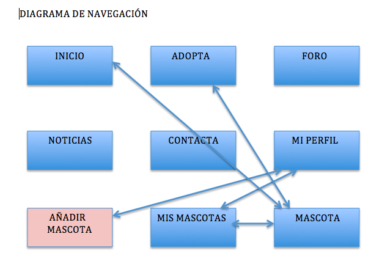

NOMBRE APLICACIÓN: adoptauncompañero.com

DESCRIPCIÓN GENERAL: Página web de adopción de mascotas. Está formada por una página de incio, una  de noticias, una galería de mascotas y un foro, que son visible para todos los usuarios. Hay una página de perfil para los usuarios registrados. Además, poseerá una funcionalidad de crear noticias, que sería privada, ya que solo el administrador puede subir nuevas noticias.

DESCRIPCIÓN ENTIDADES:
* NOTICIAS: entidad de visibilidad pública, pero de uso privado, ya que el único que puede añadir o modificar las entradas es el administrador. 
* PERFIL: entidad restringida para usuarios registrados que podrán configurar su perfil, añadir nuevas mascotas, y administrar las mascotas que ya ha publicado anteriormente.
* ANIMAL: entidad de visibilidad pública que permite a cualquier usuario ver las mascotas disponibles, y a los usuarios registrados
* FORO: entidad pública que permite visualizar los comentarios de los diferentes usuarios, además de añadir nuevas entradas cuando el usuario lo desee en el foro.
* COMENTARIOS: entidad pública que permite introducir comentarios para cada animal.

INFORMACIÓN NECESARIA PARA VISUALIZAR LA PÁGINA:
* Disponer de un navegador web compatible con javascript, bootstrap, jquery.

INFORMACIÓN NECESARIA PARA VISUALIZAR EL CÓDIGO:
* Un editor de textos, de estilos, de programación. Ejemplo: Brackets
* Navegador web

DIAGRAMA DE NAVEGACIÓN:

El resto de relaciones son n a n. 
Desde todas las páginas se puede acceder al resto, exceptuando la página añadir Mascota, a la que solo podemos acceder desde Mi Perfil, si estamos registrados.

Comenzamos en index.html:

 

Desde aquí podemos registrarnos para acceder con nuestro usuario, o acceder a la página de registro en caso de no tener aún un usuario.
También podemos enlazar con la página de Adopta.

Si estamos registrados y nos logueamos con nuestro usuario, entonces la página principal se muestra de la siguiente forma:

 

Desde aquí podemos acceder a la página de mis mascotas.

La pagina de Noticias se muestra así:

 

Adopta:

 

Desde adopta podemos ir a ver cada mascota en particular, esa pantalla la mostraremos después, ya que podemos acceder a ella desde aquí y desde la visualización de las mascotas a la que llegamos desde el perfil de usuario.

Foro:

 

Contacta con nosotros:

 

Registro:

 

Mi perfil:

 

Desde esta página podemos editar nuestro perfil, además de añadir una nueva mascota para su adopción, y ver todas las mascotas que hemos subido nosotros, en la pantalla Mis Mascotas.
Desde Mis Mascotas también podremos acceder directamente con la página de información de la mascota.

Añadir Mascota:

 

Desde aquí podemos añadir una nueva mascota, y/o volver a la página de nuestro perfil.

Mis Mascotas:

 

Desde aquí también podemos enlazar con la página personalizada de cada mascota (mascota.html)

Mascota:

 

